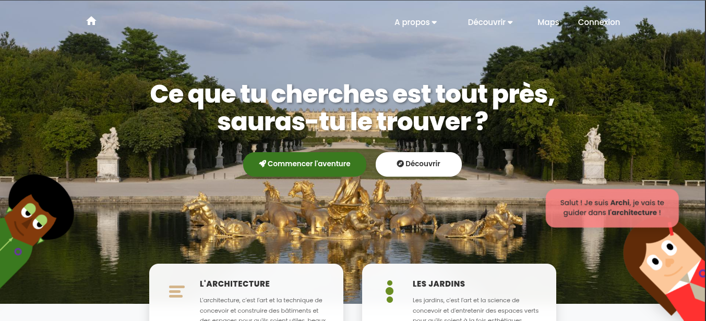
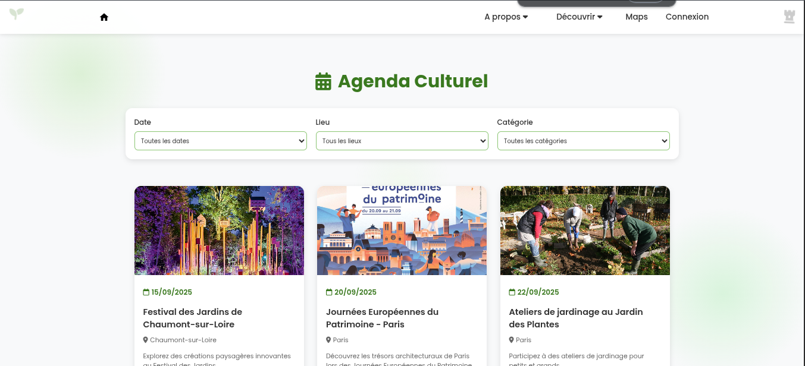
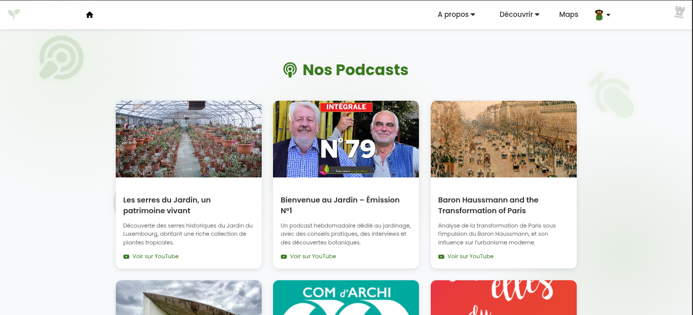
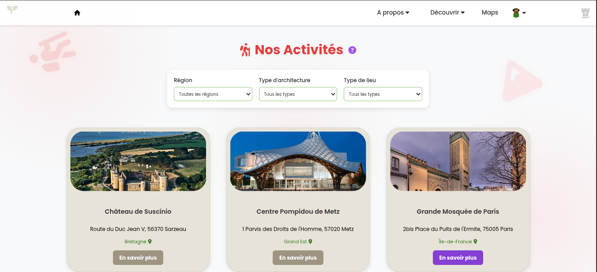
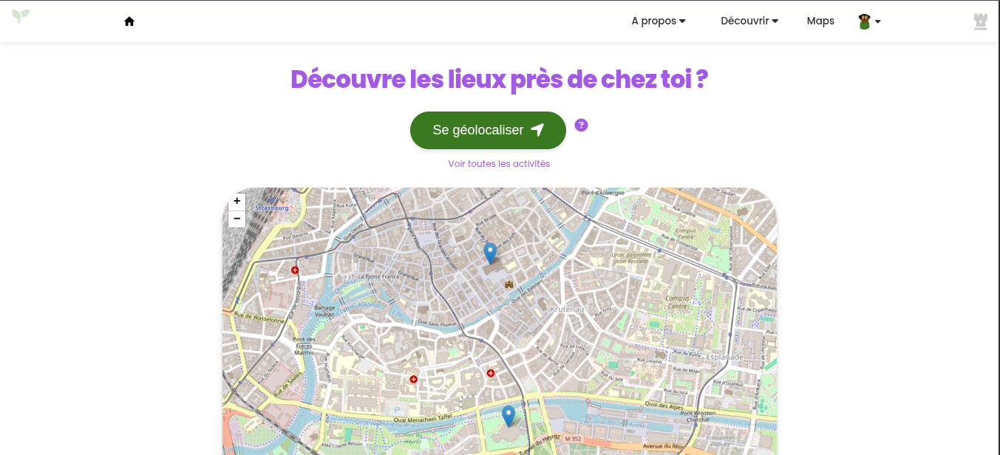
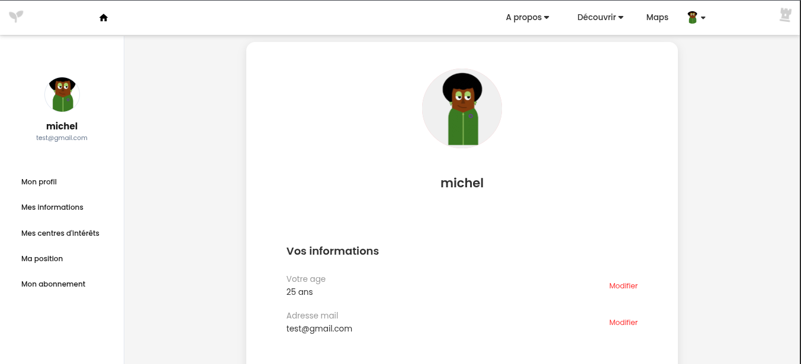

# 🚀 **FlowMedia**🚀

  

# 🌐 Flow Media – Site Culturel pour les 15-25 ans

Flow Media est un site web développé dans le cadre de la SAE 202 en MMI.  
Ce site satellite de l’AMF (Association des Maires de France) a pour but de promouvoir la culture auprès des jeunes de 15 à 25 ans à travers des activités, des événements, des podcasts, et plus encore.

## 🔗 Lien du site

👉 [Accéder au site](https://flowmedia.michel.djoumessi.mmi-velizy.fr)

- Connexion administrateur :  
  [Page de connexion](https://flowmedia.michel.djoumessi.mmi-velizy.fr/connexion/login-admin.php)  
  **Identifiants :** `admin` / `jesuisadmin`

## 🧰 Stack technique

- PHP
- HTML / CSS
- JavaScript
- MySQL
- Leaflet.js, Hammer.js

## 🚀 Fonctionnalités principales

- 🎫 Réservation d’activités culturelles géolocalisées
- 📅 Agenda culturel interactif avec filtres dynamiques
- 🧩 Quiz ludique pour gagner des points et badges
- 🎙 Podcasts exclusifs (abonnement requis)
- 📍 Carte interactive avec recommandations personnalisées
- 🧠 Algorithmes : autocomplétion, géocodage, recommandations

## 👤 Accès utilisateur

- Création de profil avec centres d’intérêts
- Suivi des réservations et historique
- Gestion des abonnements (Gratuit, Gold, Platine)
- Interface responsive (mobile & desktop)

---

**ℹ️ Conseil** : Pour bien comprendre l’architecture, consultez le [schéma du site](https://excalidraw.com/#json=9ZW3FPiba_5Po5jvp9I-8,CBPUT8KkU22r-4-aJ5s86w).

--

#🖼️ Quelques images

  

  

  

  

  

